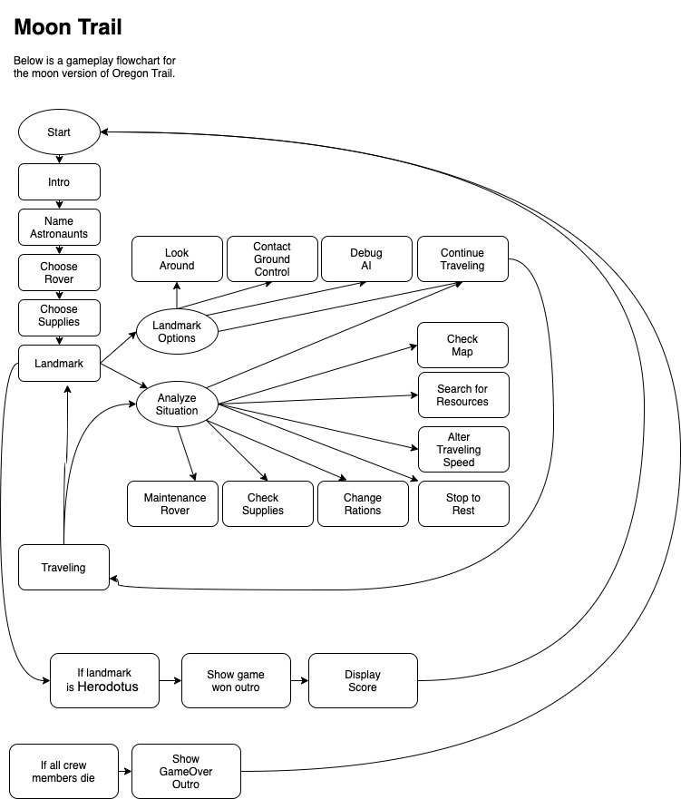
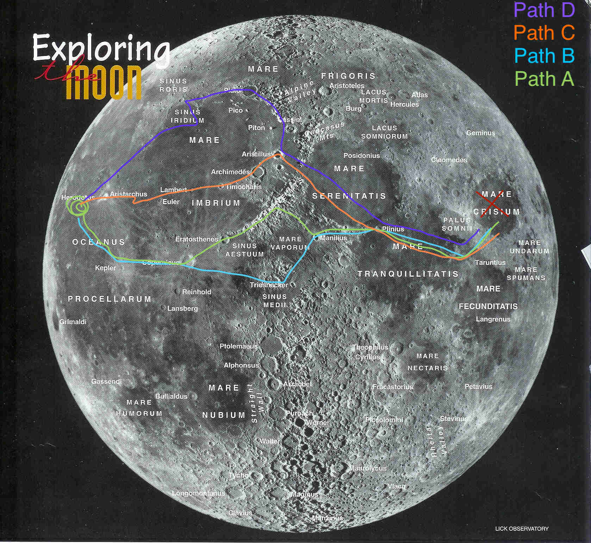

# Moon Trail

> Oregon Trail on the Moon- This app is currently under developement.

### Game Summary

On their way back from a successful mission to Mars, our spacecraft temporarily loses control of their flight systems and flies straight into a meteor shower. After being hit by a meteor, the crew is able to make an emergency landing on the moon. The crew must find their way to the emergency launch site to get back home. They can take one of four possible paths that each have their unique challenges and story elements. Strategically choosing the best equipment for a specific path and choosing to travel in a strategic way is the key to victory. The game ends either when all the crew is killed or the rover reaches the exit launch site. If the rover reaches the exit launch site, the player receives a point score for what survived the journey.

### Paths

Players can choose to take one of four paths to arrive at their destination.

