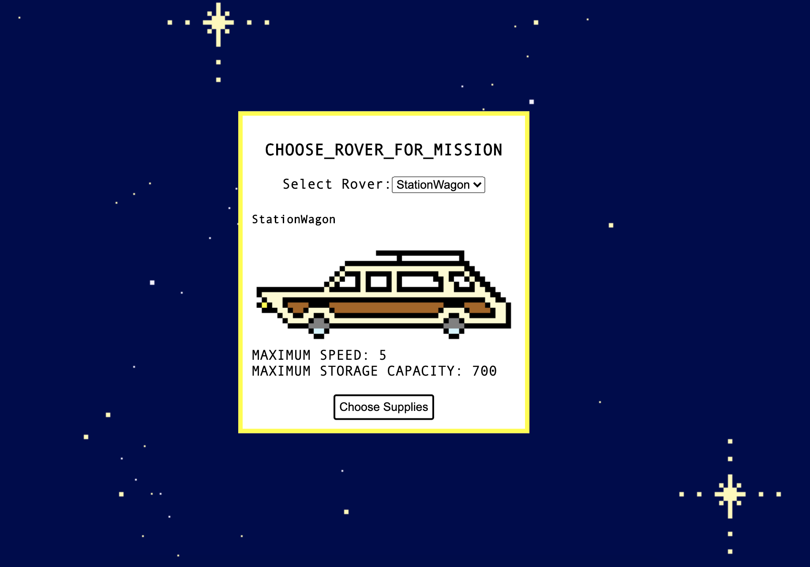
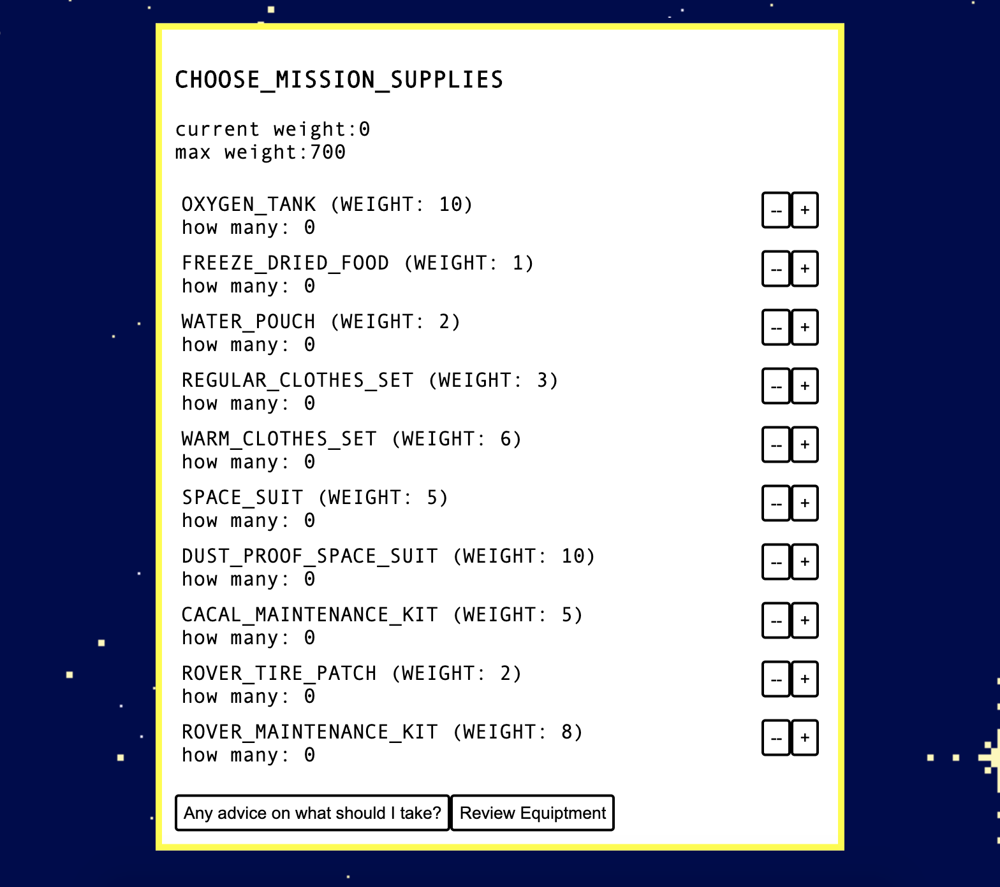

# Moon Trail

> Oregon Trail on the Moon- This app is currently under developement.

### Game Summary

On their way back from a successful mission to Mars, our spacecraft temporarily loses control of their flight systems and flies straight into a meteor shower. After being hit by a meteor, the crew is able to make an emergency landing on the moon. The crew must find their way to the emergency launch site to get back home. They can take one of four possible paths that each have their unique challenges and story elements. Strategically choosing the best equipment for a specific path and choosing to travel in a strategic way is the key to victory. The game ends either when all the crew is killed or the rover reaches the exit launch site. If the rover reaches the exit launch site, the player receives a point score for what survived the journey.


### Paths

Players can choose to take one of four paths to arrive at their destination. The journey starts at Mare Crisium (the crash site) and ends at Herodotus.


### Game Build

Using React and Javascript to create a text based adventure of survival. The app is currently under development, but if you would like to spin it up follow the directions below.

  1. Clone this repository to your local machine and open it in your code editor.
  2. In the repository's root directory, run the following commands:
    ```js
    npm run react-dev
    npm run start
    ```
  3. Open a browser tab to localhost:3024 and the app will be running

  ### Player Interface

  

  The theme of this game is strategy and planning. Choosing the correct supplies for the correct route will create a higher chance of success and higher score.

  

  After naming the five crew members, the player must choose one of three rovers that each have varying levels of speed and storage capacity.

  